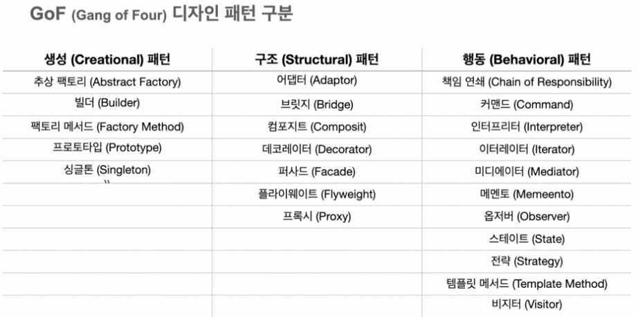
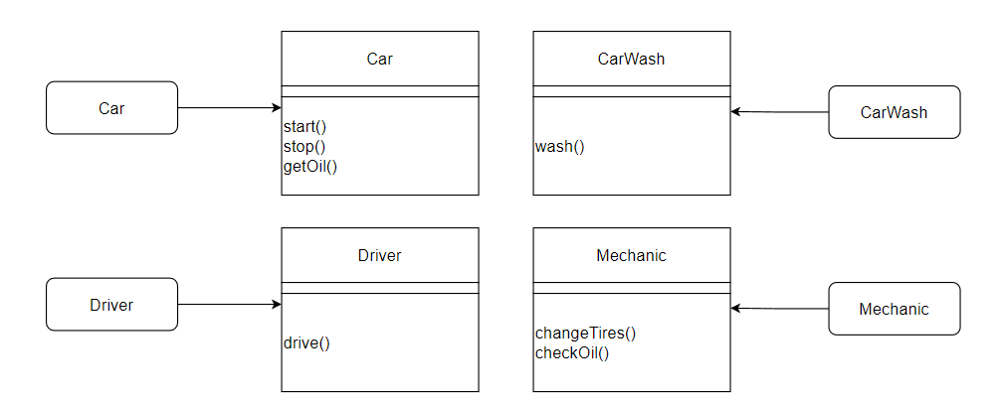
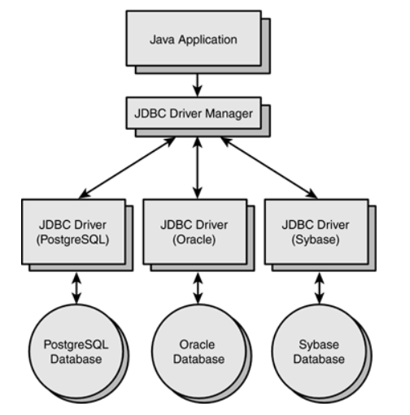
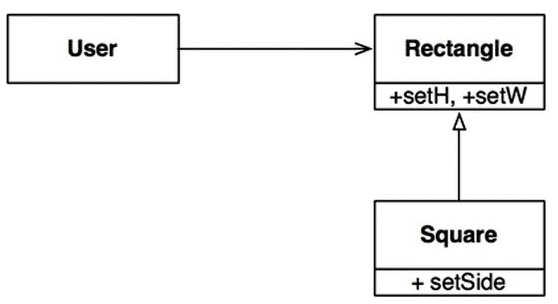
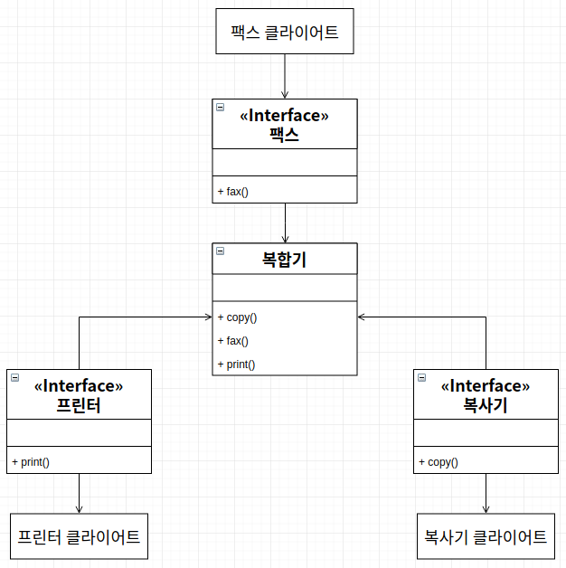

## 디자인 패턴이란?
- 특정 문맥에서 공통적으로 발생하는 문제에 대한 재사용 가능한 해결책
- BEST PRACTICE, 곧 모범사례를 통해 시야를 확장하자.
    * 생성패턴 : 객체 생성 또는 조합에 관한 패턴
    * 구조패턴 : 객체를 조합해 더 큰 구조를 만드는 패턴
    * 행위패턴 : 객체 사이의 책임분배나 커뮤니케이션에 관한 패턴

## SOLID 원칙
### 1. SRP(단일 책임 원칙) : 하나의 클래스는 하나의 책임만 가져야 한다.
   
### 2. OCP(개방-폐쇄 원칙) : 확장에는 열려있고, 변경 및 수정에는 닫혀있다.
    * 확장에는 열려 있다. : 모듈의 동작을 확장할 수 있다.
    * 변경에는 닫혀 있다. : 모듈의 소스코드나 바이너리 코드를 수정하지 않아도 모듈의 기능을 확장, 변경할 수 있다.
    * how? 추상화(인터페이스), 또는 상속을 통해서 -- 인터페이스를 통한 추상화를 권장한다.
   
### 3. LSP(리스코프 치환)  : 하위 클래스가 상위 클래스를 교체할 수 있어야한다.
    * instanceOf를 남용할 때 발생할 수 있다.
    * LSP 남용의 예시로 아래를 보면, 정사각형은 사각형을 대체할 수 없다. 
   
### 4. ISP(인터페이스 분리 원칙) : 인터페이스를 클라이언트에 특화되도록 분리하라.
   
### 5. DIP(의존관계 역전 원칙) : 상위 레벨 모듈이 하위 레벨 모듈에 의존하는 관계를 반전시키는 것