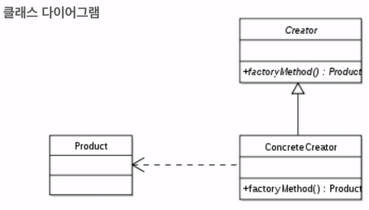

# 순서

# 1. 생성 패턴

## 싱글톤 
- 클래스의 인스턴스가 단 1개임을 보장
- 인스턴스 생성을 제어할 수 있어야함
- 1개 뿐인 인스턴스에 쉽게 접근하기 위함

## 빌더
- 복잡한 객체의 생성방법과 표현방법을 분리
- 생성방법과 구성방법 모두 캡슐화할 때 사용

## 팩토리
- 자주 사용되는 디자인 패턴이다. 
- 복잡한 객체 생성을 캡슐화 해야함
- 생성은 다른 클래스(Factory)에게 위임하려함
- 어떤 인스턴스를 만들어야할지 알 수 없다.

# 2. 구조 패턴

## 어뎁터
- 인터페이스가 서로 맞지 않을 때 (플러그)
- 서로 다른 인터페이스를 함께 동작하고자 함

## 파사드
- 복잡한 서브시스템에 인터페이스를 단순하게 구성하고자 할때
- 시스템 간에 결합도를 줄이고자 할 때
- 서브시스템을 계층화시키고 싶을 때

## 데코레이터
- 기존 객체 수정 없이 새로운 책임을 추가하고 싶을 때

## 프록시
- 객체에 접근을 제어하고 싶을 때
  1. 객체를 실제 사용하기 전까지 초기화를 미루고 싶을 때 (Lazy init)
  2. 접근 권한 체크
- 어뎁터 패턴 : 객체의 기능을 추가할 때
- 데코레이터 패턴 : 객체에 새로운 책임을 추가할 때
- 프록시 패턴 : 접근 권한 체크 - 객체 권한 체크, 로딩 시점 체크할 때

# 3. 행동 패턴

## 스트러티지
- 클라이언트에 독립적으로 문제 해결 전략을 바꾸고 싶을 때
- 다양한 문제해결 방법을 제공해야할 때

## 템플릿 메소드
- 문제해결의 큰 흐름은 유지하고, 단계별 처리는 위임하고자 할 때
- 구체적인 처리방법은 하위 클래스로 위임하고자 할 때
- !! 템플릿이 조금이라도 변경될 가능성이 있으면 절대 쓰면 안 된다.
- ex. 결제 기능을 추가할 때 : 제휴사 통신, 정보, 현재 정보, 요청 보내기 --> 템플릿?
- ----> 실제로 중복되지 않은 경우가 많다. (회사별, 도메인별로 다른 기능 구현) 
- ----> 이럴 때는 전략 패턴을 사용하는 것이 좋다.

## 책임연쇄 패턴
- 메세지를 보내는 객체와 처리하는 객체를 분리하고 싶을 때
- 하나의 메세지를 여러 객체가 처리해야할 때

