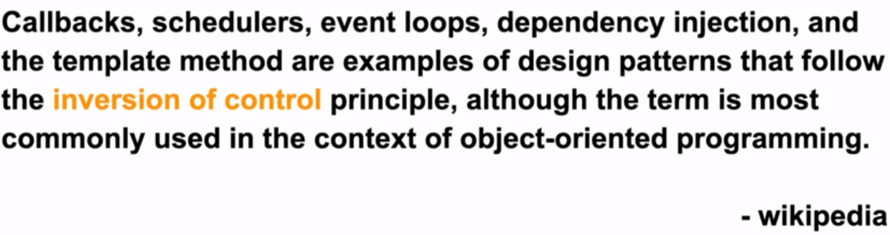

# 의존성이란?
## 1. Dependency
    * Dependency = 의존성
    * "A가 B를 사용한다"의 의미
        1. 맴버변수
        2. 메서드 파라미터
        3. 메서드 내 로컬 변수
        4. 메서드 반환값

## 2. Class간 관계

### - Association (연관관계)
    (1) Aggregation (집합관계) : A의 생성자로 B를 받는다. (A ⊃ B)
        ex. 자동차의 부품 
    (2) Composition (복합관계) : A의 생성할 때 B도 생성. (A가 사라질 때, B도 사라짐)
        ex. 사람의 몸
    * Directed Association : 한 방향. 한쪽에게 영향을 받고 있음을 나타낸다.

[그림_Association]    

    

[그림_Directed Asssociation]   

### - Dependency (의존관계)
    

### - Generalization (일반화관계)
    * 일반적으로 상속을 의미한다.
    

### - Realization (실체화관계)
    * 일반적으로 구현을 의미한다.

# IoC란?
    * Inversion of Control
    * 할리우드 원칙 : "Don't call us, we'll call you"
      --> "프로그램의 흐름 제어 주체가 바뀌는 것"
      --> "호출하지 마세요, 우리가 호출 할게요"
    * 전통적인 방식의 제어 흐름 : 절차지향적 -- 개발자가 작성한 코드가 메인함수부터 순차적으로 실행됨
    * 제어 흐름 역전(IoC) : 메인함수가 실행된 후, 개발자가 작성한 코드가 언젠가 호출 당한다.     

# DI란?
    * Martin Fowler가 논문에서 언급(2004)
    * 컴파일 시, 클래스의 관계를 설정하고 (컴파일 의존성)
    * 런타임 시, 인터페이스의 구현체를 찾아 주입한다. (런타임 의존성)
    * 경량 컨테이너(ex. Spring)에서 IoC를 이용하여, 별도의 조립모듈에서 객체를 만들고, 객체간 디펜던시를 연결하여 관리함
      --> 경량 컨테이너를 IoC 컨테이너, DI 컨테이너로 부르기도 한다. 
    * DI의 기본 아이디어는, 객체들을 연결해주는 별도의 객체를 갖는 것이다.
[Martin Fowler_Injection 아티클 링크](https://martinfowler.com/articles/injection.html)     

| DI 이전                     | DI 이후                     |
|---------------------------|---------------------------|
|   |   |

| DI 이전                     | DI 이후                     |
|---------------------------|---------------------------|
|  |  |

# DIP란?
    상위 레벨 모듈이 하위 레벨 모듈에 의존하는 관계를 반전시키는 것
    A. 상위 레벨 모듈은 하위 레벨 모듈에 의존하면 안되고, 둘 다 추상적인 것에 의존해야한다.
    B. 추상적인 것은 구체적인 것에 의존하면 한되고, 구체적인 것은 추상적인 것에 의존해야한다.

# 정리
